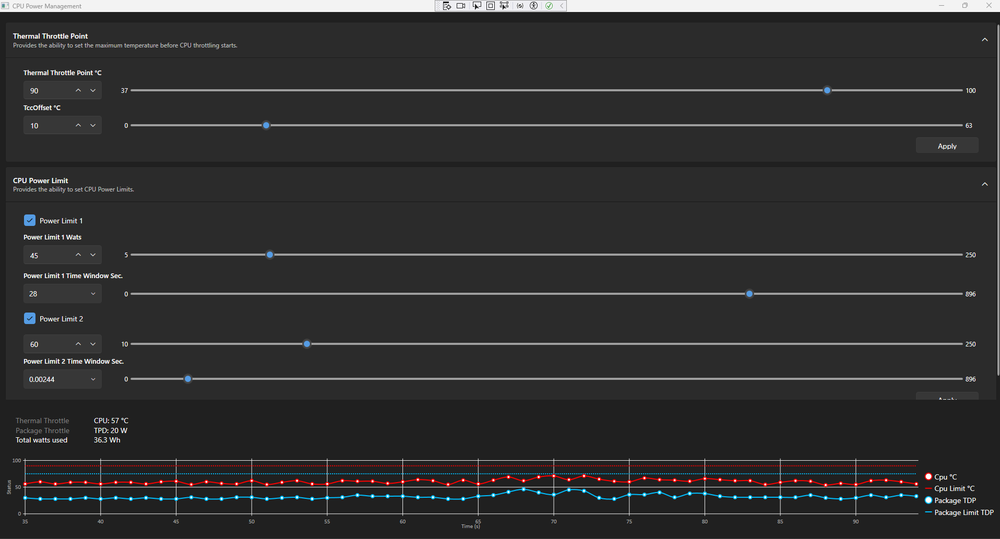

# CPU Power Management

**CpuPowerManagement** is a WPF application for monitoring and adjusting Intel CPU power limits using MSR registers. It supports PL1/PL2 configuration (including time windows), displays power usage, temperature, and real-time throttling status.

## Features

- **PL1 / PL2 Power Limit Control**:
  - Enable or disable PL1/PL2
  - Set power value in watts (W)
  - Configure the time window using a slider or dropdown with valid values
- **Real-time Monitoring**:
  - Current CPU temperature
  - Power usage (TDP)
  - Live throttling status chart (last 60 seconds)
- **MSR-based Intel RAPL Support**:
  - Uses registers like 0x610 (IA32_PKG_POWER_LIMIT), 0x19C (IA32_THERM_STATUS), 0x1B1 (IA32_PACKAGE_THERM_STATUS)

## Screenshot



## Architecture

- **WPF UI**: Uses `LiveCharts.Wpf` for graphs and `WpfUi` for visual components
- **ViewModels**:
  - `PowerLimitViewModel`: PL1/PL2 control
  - `CpuStatusViewModel`: CPU state monitoring
  - `MainWindowViewModel`: Root view model
- **MSR Access**:
  - Uses the custom CLI tool `CpuPowerManagement.CLI` for reading/writing MSRs (based on `WinRing0` or similar kernel driver)

## Requirements

- Windows 10/11 x64
- Administrator rights (required for MSR access)
- .NET 6.0 or newer

## Building and Running

```bash
git clone https://github.com/yourname/CpuPowerManagement.git
cd CpuPowerManagement
# Open the solution in Visual Studio 2022+
# Build and run the project (x64, Release or Debug)
